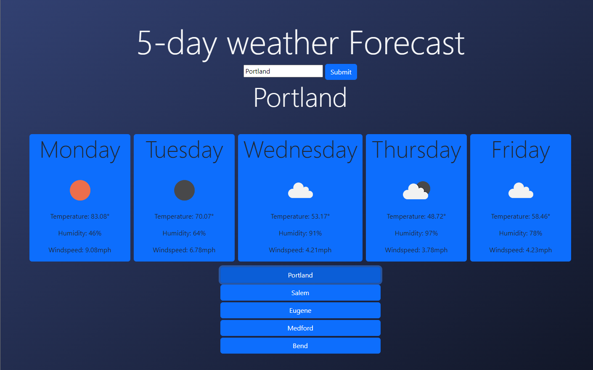

# 5-day Weather Forecast

This is a web application that provides a 5-day weather forecast for a specific city. Users can enter a city name, click the submit button, and view the weather forecast for the next five days.

## Features

- Enter a city name: Users can input the name of a city in the provided text input field.
- Fetch weather data: When the submit button is clicked, the application fetches weather data from the OpenWeatherMap API.
- Display weather forecast: The application displays the weather forecast for the next five days, including temperature, humidity, wind speed, and weather icon.
- Save city names: Each time a search is made, the entered city name is saved as a button for quick access in the future.

## Technologies Used

- HTML: Markup language for structuring the web page.
- CSS: Styling language for enhancing the visual appearance of the application.
- Bootstrap: CSS framework used for responsive and mobile-first design.
- JavaScript: Programming language used for application logic and interactivity.
- Fetch API: JavaScript API used for making HTTP requests to retrieve weather data.
- OpenWeatherMap API: External weather API used to fetch weather data for the entered city.

## Contact

Here's a [Link](https://github.com/brendan-aper/weather-app) to the Github

And here's the [link](https://brendan-aper.github.io/weather-app/) to the live site!!

## Usage

1. Enter a city name in the provided text input field.
2. Click the submit button to fetch the weather forecast for the entered city.
3. The weather forecast for the next five days will be displayed, including temperature, humidity, wind speed, and weather icon.
4. The entered city name will be saved as a button for quick access in the future. Clicking on a saved city button will fetch the weather forecast for that city.

## License

N/A
